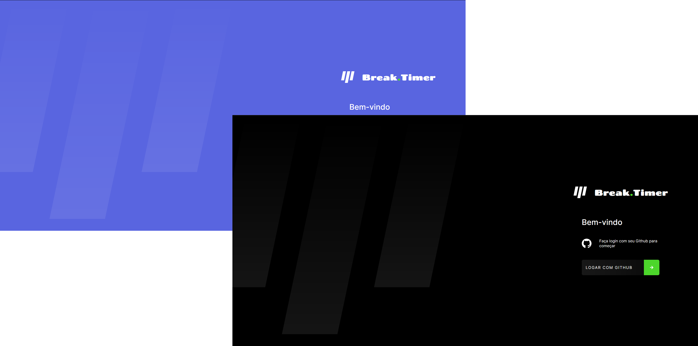
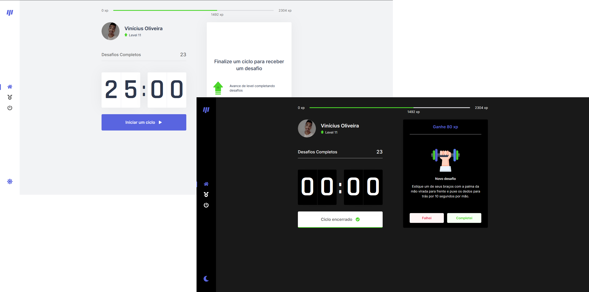
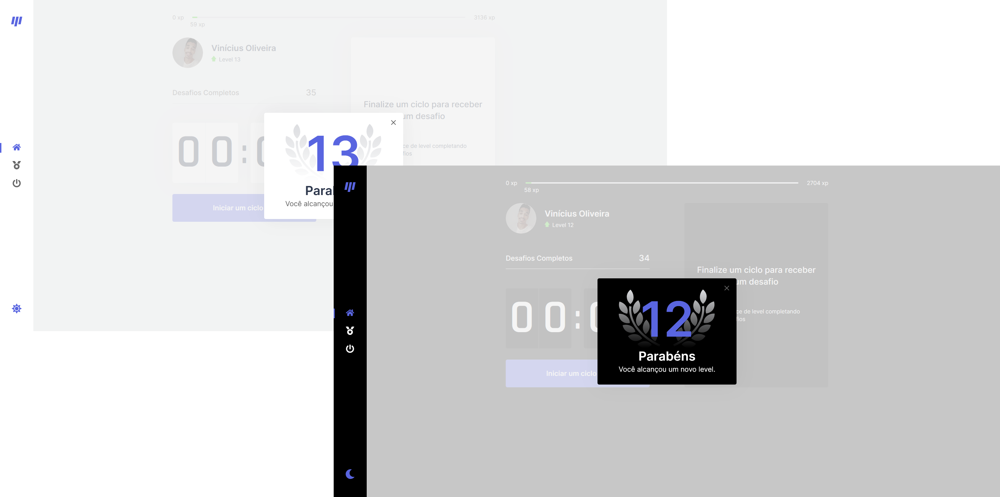
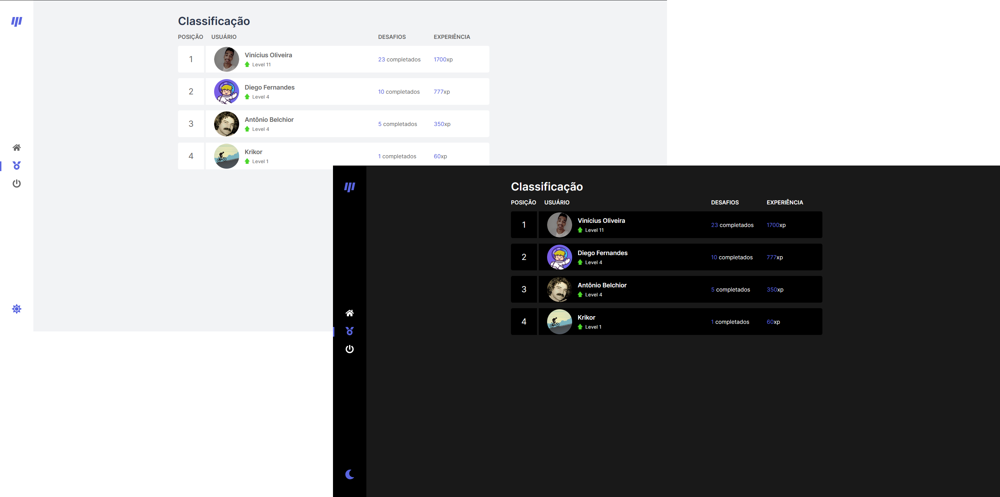

<p align="center">

  

  
  
  <a href="https://github.com/oviniciusoliveira/breaktimer/commits/master">
    
  </a>
    
   
</p>
</p>

<h1 align="center">
  <a href="https://breaktimer.vercel.app/">
      
  </a>
</h1>

## 📖 Tópicos

<p>
 👉<a href="#-sobre-o-projeto" style="text-decoration: none; "> Sobre o Projeto</a> <br/>
👉<a href="#-funcionalidades" style="text-decoration: none; "> Funcionalidades</a> <br/>
👉<a href="#-layout" style="text-decoration: none"> Layout</a> <br/>
👉<a href="#-como-executar-o-projeto" style="text-decoration: none"> Instalação e Configuração</a> <br/>
👉<a href="#-tecnologias" style="text-decoration: none"> Tecnologias Utilizadas</a> <br/>
👉<a href="#-desenvolvedor" style="text-decoration: none"> Desenvolvedor</a> <br/>
👉<a href="#-licence" style="text-decoration: none"> Licença</a>

</p>

<a name="-sobre-o-projeto"></a>

## 💻 Sobre o projeto

Aplicação para auxiliar o seu gerenciamento de tempo, inspirada pela técnica de pomodoro. Além de incentivar exercícios físicos, alongamentos e exercícios para os olhos durante os intervalos.

Também é implementado elementos de RPG (níveis e ranking global) para te manter motivado.

### 🍅 O que é a Técnica de Pomodoro?
A técnica de Pomodoro consiste em você dividir seu tempo de estudo e trabalho em pequenos blocos de intervalo, normalmente com duração de 25 minutos e separados por uma curta pausa.

Cada bloco é conhecido como um pomodoro, onde você aplica foco total em sua atividade, após o tempo acabar, você descansa por um breve período, tradicionalmente 5 minutos, e após isso retorna à atividade.

### 🎲 Como funciona o Break.Timer?
Na páina inicial há um contador regressivo que inicia em 25 minutos para marcar seu tempo de pomodoro.

Após o tempo acabar, iremos te indicar um exercício para realizar, pode ser um alongamento físico ou um relaxamento aos seus olhos. Caso você consiga concluir o desafio, ganhará uma certa quantidade de pontos de experiência.

Conforme você for acumulando experiência, seu nível irá aumentar e você poderá ver sua colocação no ranking global, que inclui todos os usuários do Break.Timer.

O projeto está publicado em: <a align="center" href="https://breaktimer.vercel.app/">

</a>

---

<a name="-funcionalidades"></a>

## ⚙️ Funcionalidades

- [x] Páginas
  - [x] Login
    - [x] Autenticação com GitHub oAuth
  - [x] Principal
    - [x] Experiência
    - [x] Perfil
    - [x] Countdown
    - [x] Desafios
  - [x] Ranking
    - [x] Informações de Todos os Usuários
- [X] Integração com MongoDB
  - [X] Rota para cadastrar novo usuário
  - [X] Rota para buscar usuário existente
  - [X] Rota para atualizar usuário existente
  - [X] Rota para buscar todos usuários existentes
- [X] Logout da Aplicação
- [X] Tema Dark/Light
- [X] Responsivo para Mobile

---

<a name="-layout"></a>

## 🎨 Layout

### Login

<h1 align="center">
    
</h1>

### Página Principal

<h1 align="center">
    
</h1>

### Level Up

<h1 align="center">
    
</h1>

### Ranking

<h1 align="center">
    
</h1>

---

<a name="-como-executar-o-projeto"></a>

## 🛠 Instalação e Configuração do Projeto

### Pré-requisitos

Para executar os comandos, é necessário possuir as seguintes ferramentas instaladas:

[Git](https://git-scm.com) e [Node.js](https://nodejs.org/en/).

Para manipular o código, recomendo utilizar o [VSCode](https://code.visualstudio.com/).

#### 🎮 Rodando a aplicação web (Frontend)

1. Clone este repositório

   ```sh
   git clone https://github.com/oviniciusoliveira/breaktimer.git
   ```

2. Acesse a pasta do projeto no seu terminal

   ```sh
   cd breaktimer
   ```

3. Instale as dependências

   ```sh
   npm install
   ```

4. Altere o nome do arquivo .env.sample para .env e configure as variáveis de ambiente

5. Execute a aplicação em modo de desenvolvimento

   ```sh
   npm run dev
   ```

6. A aplicação será aberta na porta 3000 - Acesse http://localhost:3000

---

<a name="-tecnologias"></a>

## 🧱 Tecnologias Utilizadas

#### **Website** ([Next.js](https://nextjs.org/) + [TypeScript](https://www.typescriptlang.org/))

#### **Front-end** hospedado na [Vercel](https://vercel.com/)
#### **Banco de Dados** ([MongoDB](https://www.mongodb.com/)) hospedado na [MongoDB Atlas](https://www.mongodb.com/cloud/atlas)

#### **Autenticação** utilizando [GitHub oAuth](https://github.com/)

#### **Principais Bibliotecas Utilizadas**

- **[React](https://reactjs.org/)**
- **[Axios](https://github.com/axios/axios)**
- **[NextAuth.js](https://next-auth.js.org/)**

> Mais informações no [package.json](https://github.com/oviniciusoliveira/breaktimer/blob/master/package.json)

#### **Ferramentas e utilitários usados durante o desenvolvimento**
- Editor: **[Visual Studio Code](https://code.visualstudio.com/)**
- Testes de API: **[Insomnia](https://insomnia.rest/)**
- Database Manager: **[MongoDB Compass](https://www.mongodb.com/products/compass)**

#### **Fontes Utilizadas**
- **[Inter](https://fonts.google.com/specimen/Inter)**
- **[Rajdhani](https://fonts.google.com/specimen/Rajdhani)**
---

<a name="-desenvolvedor"></a>

## 🐱‍👤 **Desenvolvedor**

<p>
 
 <br />
 <sub><strong>⭐Vinícius Oliveira⭐</strong></sub>
</p>

[](https://www.linkedin.com/in/oviniciusoliveira/)

---

<a name="-licence"></a>

## 📝 Licença

Este projeto esta sob a licença [MIT](./LICENSE).

Feito com 💙 por Vinícius Oliveira [👋 Entre em contato!](https://www.linkedin.com/in/oviniciusoliveira/)

---
